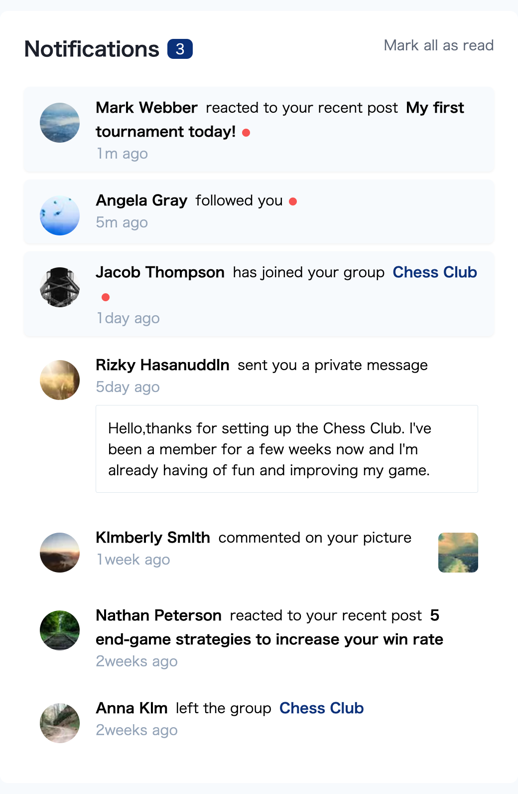

# Frontend Mentor - Notifications page solution

This is a solution to the [Notifications page challenge on Frontend Mentor](https://www.frontendmentor.io/challenges/notifications-page-DqK5QAmKbC). Frontend Mentor challenges help you improve your coding skills by building realistic projects. 

## Table of contents

- [Frontend Mentor - Notifications page solution](#frontend-mentor---notifications-page-solution)
  - [Table of contents](#table-of-contents)
  - [Overview](#overview)
    - [The challenge](#the-challenge)
    - [Screenshot](#screenshot)
    - [Links](#links)
  - [My process](#my-process)
    - [Built with](#built-with)
    - [What I learned](#what-i-learned)
    - [Continued development](#continued-development)
    - [Useful resources](#useful-resources)
  - [Author](#author)
  - [Acknowledgments](#acknowledgments)

## Overview

### The challenge

Users should be able to:

- Distinguish between "unread" and "read" notifications
- Select "Mark all as read" to toggle the visual state of the unread notifications and set the number of unread messages to zero
- View the optimal layout for the interface depending on their device's screen size
- See hover and focus states for all interactive elements on the page

### Screenshot

|desktop|mobile|
|-------|------|
|<kbd></kbd>|<kbd><kbd>|

### Links

- Solution URL: [Add solution URL here](https://your-solution-url.com)
- Live Site URL: [Add live site URL here](https://your-live-site-url.com)

## My process

### Built with

- [React](https://reactjs.org/) - JS library
- [Next.js](https://nextjs.org/) - React framework
- [tailwindcss/jit](https://tailwindcss.com/) - For styles
- [vercel](https://vercel.com/dashboard)

### What I learned

- how to use `vercel` 
- how to use `next.js`
- how to use `tailwindcss`

### Continued development

### Useful resources

- [Flowbite](https://flowbite.com/docs/components/avatar/)
- [converting colors](https://convertingcolors.com/hsl-color-211_68_94.html?search=hsl(211,%2068%,%2094%))
- [picsum.photos](https://picsum.photos/)
- [placeimage](https://placeimg.com/)

## Author

- Frontend Mentor - [@yukihirop](https://www.frontendmentor.io/profile/yukihirop)

## Acknowledgments

- [vercel environment variable](https://vercel.com/docs/concepts/projects/environment-variables#system-environment-variables)
